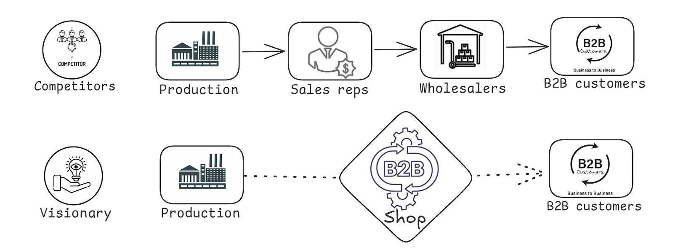

# EKI Blog

## Simplifying the customer journey

Visionary designs, makes, and sells all its LED products from its facilities in New Zealand. Since starting in 2012, the company has led the way in offering high-quality lighting products at fair prices. They keep costs low by not using wholesalers, which is common in the industry.

With Litekart, the company automated the manual buying processes previously managed by their sales team, allowing direct sales to their B2B customers. This simplified the customer journey, reduced time-to-market, and freed up the sales team to focus on acquiring new customers instead of processing orders.

 

## Advanced commerce needs

Like many B2B webshops, Visionary needed more from their commerce backend than just handling standard tasks like products, carts, checkout, and orders. They specifically required:

 <b>Unlimited Product Variants:</b> The store must support products with up to 300 variants, each with different prices and product images.

 <b>Customer Login and Authentication:</b> The store should be accessible only to authenticated users from companies that Visionary partners with.

<b>Multiple Employees per Customer:</b> Each B2B customer has several employees who need the ability to make purchases on the platform for their company

<b>Special Pricing and Discounts:</b> Visionary wanted a loyalty program where customers earn discounts and special benefits based on their spending levels.

<b>ERP Synchronization:</b> Once an order is completed, Litekart needs to sync it with Visionary’s ERP system for production and fulfillment.

While exploring options, Typed Development quickly found that most SaaS ecommerce solutions lacked the needed flexibility. Instead, they chose Litekart’s commerce modules, which provided the right commerce logic to start quickly and the flexibility to meet Visionary’s custom needs.

## Linking customers and companies

Visionary wanted the employees of their B2B customers to handle purchasing independently in the online store. This would allow Visionary's sales reps to spend less time processing manual orders and more time acquiring new customers. Additionally, existing B2B customers would benefit from a smoother purchasing experience, allowing their employees to easily complete orders online.

To let employees of B2B customers make direct purchases, Typed Development added an employee layer to Litekart. This ensures that employees are linked to their companies when they log into the store. Once logged in, they can browse products and make purchases for their company. After an order is placed, the information is sent to a custom ERP system for production and fulfillment. In this setup:

<b>Employees</b> own carts, which allows them to create orders.

<b>Companies</b> own orders, which means they handle payments via invoices upon order completion.

In addition to employee accounts, each company has admin accounts. These admin accounts can create orders, add new employees, and view all order and billing information.

## Towards full automation

By the end of 2023, Visionary expects to manage over 1,000 orders per month through Litekart. With their B2B ecommerce system already set up, the company is now working on digitizing and automating even more of its processes.

One process Visionary wants to improve is order fulfillment with their ERP system. Right now, it involves a lot of manual copy-pasting of order data from Litekart into the ERP. Typed Development plans to use Litekart’s new Admin Widgets to enhance the current order overview in Litekart. This will let Visionary manage delivery services and fulfillment directly in Litekart and then transfer that information to the ERP.

Typed Development believes that choosing an open and flexible solution like Litekartgives them the freedom to easily create custom automations. These improvements will benefit Visionary’s sales operations in the future.